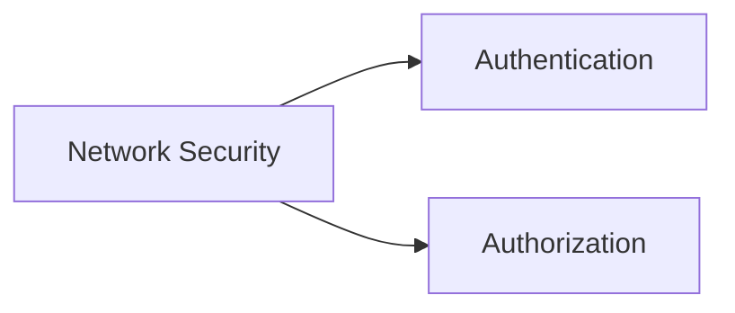

# Network Security

- Network Security is a set of operations for protecting data, applications, devices and systems connected to the network.
- It focuses on the system design, operation and management of the architecture/infrastructure to provide network accessibility, integrity, continuity and reliability.

# Traffic Analysis

- Traffic Analysis comes under Network Security. 
- its primary focus is investigating the network data to identify problems and anomalies.

### Network Security

Network Security focuses on two core concepts: authentication and authorisation.

Network security operations contain three base control levels to ensure the maximum available security management.

##### Base Network Security Control Levels:

|                    |                                                                                                                                                                                             |
| ------------------ | ------------------------------------------------------------------------------------------------------------------------------------------------------------------------------------------- |
| **Physical**       | Physical security controls prevent unauthorised physical access to networking devices, cable boards, locks, and all linked components.          |
| **Technical**      | Data security controls prevent unauthorised access to network data, like installing tunnels and implementing security layers.                   |
| **Administrative** | Administrative security controls provide consistency in security operations like creating policies, access levels and authentication processes. |

The most common elements used in network security operations are explained below.

##### The main approaches:

|                                                                                                             |                                                                                                                                               |
| ----------------------------------------------------------------------------------------------------------- | --------------------------------------------------------------------------------------------------------------------------------------------- |
| **Access Control**                                                                                          | **Threat Control**                                                                                                                            |
| The starting point of Network Security. It is a set of controls to ensure authentication and authorisation. | Detecting and preventing anomalous/malicious activities on the network. It contains both internal (trusted) and external traffic data probes. |
|                                                                                                             |                                                                                                                                               |

##### The key elements of Access Control:

|                                          |                                                                                                                                                                                                                       |
| ---------------------------------------- | --------------------------------------------------------------------------------------------------------------------------------------------------------------------------------------------------------------------- |
| **Firewall Protection**               | Controls incoming and outgoing network traffic with predetermined security rules. Designed to block suspicious/malicious traffic and application-layer threats while allowing legitimate and expected traffic.        |
| **Network Access Control (NAC)**         | Controls the devices' suitability before access to the network. Designed to verify device specifications and conditions are compliant with the predetermined profile before connecting to the network.                |
| **Identity and Access Management (IAM)** | Controls and manages the asset identities and user access to data systems and resources over the network.                                                                                                             |
| **Load Balancing**                       | Controls the resource usage to distribute (based on metrics) tasks over a set of resources and improve overall data processing flow.                                                                                  |
| **Network Segmentation   **           | Creates and controls network ranges and segmentation to isolate the users' access levels, group assets with common functionalities, and improve the protection of sensitive/internal devices/data in a safer network. |
| **Virtual Private Networks (VPN)   ** | Creates and controls encrypted communication between devices (typically for secure remote access) over the network (including communications over the internet).                                                      |
| **Zero Trust Model**                     | Suggests configuring and implementing the access and permissions at a minimum level (providing access required to fulfil the assigned role). The mindset is focused on: "Never trust, always verify".                 |

##### The key elements of Threat Control:

|                                                                 |                                                                                                                                                                                                                                                                   |
| --------------------------------------------------------------- | ----------------------------------------------------------------------------------------------------------------------------------------------------------------------------------------------------------------------------------------------------------------- |
| **Intrusion Detection and Prevention (IDS/IPS)   **          | Inspects the traffic and creates alerts (IDS) or resets the connection (IPS) when detecting an anomaly/threat.                                                                                                                                                    |
| **Data Loss Prevention (DLP)   **                            | Inspects the traffic (performs content inspection and contextual analysis of the data on the wire) and blocks the extraction of sensitive data.                                                                                                                   |
| **Endpoint Protection   **                                   | Protecting all kinds of endpoints and appliances that connect to the network by using a multi-layered approach like encryption, antivirus, antimalware, DLP, and IDS/IPS.                                                                                         |
| **Cloud Security**                                              | Protecting cloud/online-based systems resources from threats and data leakage by applying suitable countermeasures like VPN and data encryption.                                                                                                                  |
| **Security Information and Event Management (SIEM)   **      | Technology that helps threat detection, compliance, and security incident management, through available data (logs and traffic statistics) by using event and context analysis to identify anomalies, threats, and vulnerabilities.                               |
| **Security Orchestration Automation and Response (SOAR)   ** | Technology that helps coordinate and automates tasks between various people, tools, and data within a single platform to identify anomalies, threats, and vulnerabilities. It also supports vulnerability management, incident response, and security operations. |
| **Network Traffic Analysis & Network Detection and Response**   | Inspecting network traffic or traffic capture to identify anomalies and threats.                                                                                                                                                                                  |

##### Typical Network Security Management Operation is explained in the given table:  

|                                                                               |                                                                   |                                                                                         |                                                                                                                          |                                                                                                           |
| ----------------------------------------------------------------------------- | ----------------------------------------------------------------- | --------------------------------------------------------------------------------------- | ------------------------------------------------------------------------------------------------------------------------ | --------------------------------------------------------------------------------------------------------- |
| **Deployment**                                                                | **Configuration**                                                 | **Management**                                                                          | **Monitoring**                                                                                                           | **Maintenance**                                                                                           |
| - Device and software installation - Initial configuration - Automation | - Feature configuration - Initial network access configuration | - Security policy implementation - NAT and VPN implementation - Threat mitigation | - System monitoring - User activity monitoring - Threat monitoring        - Log and traffic sample capturing | - Upgrades - Security updates - Rule adjustments - Licence management - Configuration updates |

##### Managed Security Services  

MSS are services that have been outsourced to service providers. These service providers are called Managed Security Service Providers (MSSPs). Today, most MSS are time and cost effective, can be conducted in-house or outsourced, are easy to engage, and ease the management process. There are various elements of MSS, and the most common ones are explained below.  

|                                 |                                                                                                                                                                                           |
| ------------------------------- | ----------------------------------------------------------------------------------------------------------------------------------------------------------------------------------------- |
| **Network Penetration Testing** | Assessing network security by simulating external/internal attacker techniques to breach the network.                                                                                     |
| **Vulnerability Assessment**    | Assessing network security by discovering and analysing vulnerabilities in the environment.                                                                                               |
| **Incident Response   **     | An organised approach to addressing and managing a security breach. It contains a set of actions to identify, contain, and eliminate incidents.                                           |
| **Behavioural Analysis**        | An organised approach to addressing system and user behaviours, creating baselines and traffic profiles for specific patterns to detect anomalies, threats, vulnerabilities, and attacks. |