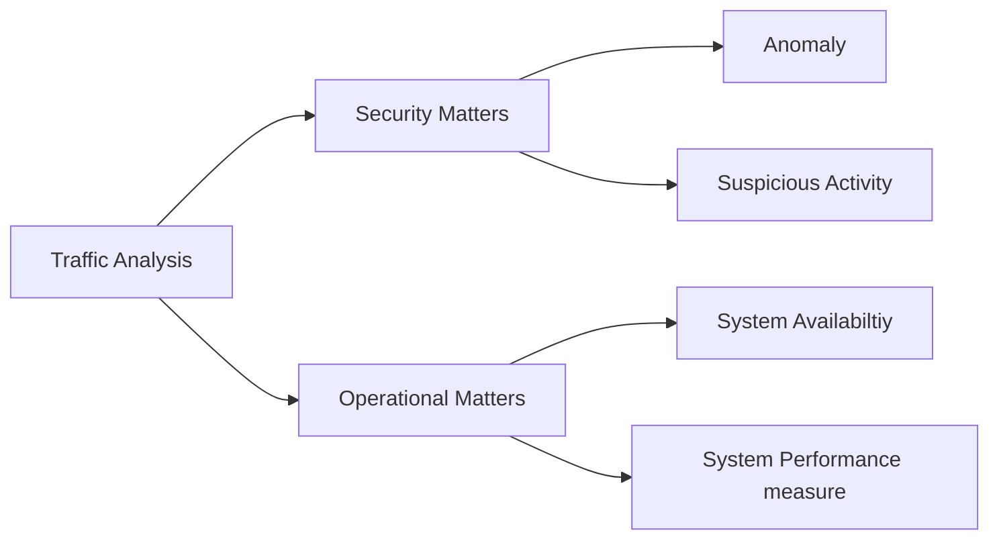

# Network Traffic Analysis

Traffic Analysis is a method of intercepting, recording/monitoring, and analysing network data and communication patterns to detect and respond to system health issues, network anomalies, and threats. The network is a rich data source, so traffic analysis is useful for security and operational matters. The operational issues cover system availability checks and measuring performance, and the security issues cover anomaly and suspicious activity detection on the network.

It is part of multiple disciplines of network security operations:

- Network Sniffing and Packet Analysis (THM [**Wireshark room**](https://tryhackme.com/room/wiresharkthebasics))
- Network Monitoring (THM [**Zeek room**](https://tryhackme.com/room/zeekbro))
- Intrusion Detection and Prevention (THM [**Snort room**](https://tryhackme.com/room/snort))  
- Network Forensics (THM [**NetworkMiner room**](https://tryhackme.com/room/networkminer))
- Threat Hunting (THM [**Brim room**](https://tryhackme.com/room/brim))

There are two main techniques used in Traffic Analysis:

|                                                                                                                                                                                                                                                                                                                                                                                     |                                                                                                                                                                                                                                                                                                                                                                                    |
| ----------------------------------------------------------------------------------------------------------------------------------------------------------------------------------------------------------------------------------------------------------------------------------------------------------------------------------------------------------------------------------- | ---------------------------------------------------------------------------------------------------------------------------------------------------------------------------------------------------------------------------------------------------------------------------------------------------------------------------------------------------------------------------------- |
| **Flow Analysis**                                                                                                                                                                                                                                                                                                                                                                   | **Packet Analysis**                                                                                                                                                                                                                                                                                                                                                                |
| Collecting evidence from the networking devices. This type of analysis aims to provide statistical results through the data summary without applying in-depth packet-level investigation.  - **Advantage:** Easy to collect and analyse. - **Challenge:** Doesn't provide full packet details to get the root cause of a case. | Collecting all available network data. Applying in-depth packet-level investigation (often called Deep Packet Inspection (DPI) ) to detect and block anomalous and malicious packets.  - **Advantage:** Provides full packet details to get the root cause of a case. - **Challenge:** Requires time and skillset to analyse. |

> [!note] Note #note
> Even if the network data is encoded/encrypted, it still provides a value by pointing to an odd, weird or unexpected pattern/situation. Therefore traffic analysis is still a must-to-have skill for any security analyst who wants to detect and respond to advanced threats.
