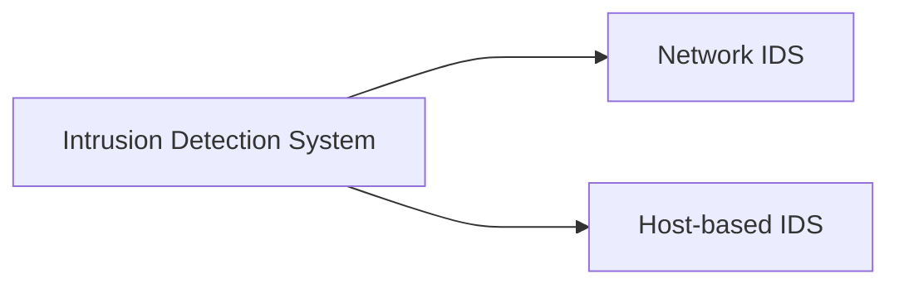

# SNORT

_Snort is the foremost Open Source Intrusion Prevention System (IPS) in the world. Snort IPS uses a series of rules that help define malicious network activity and uses those rules to find packets that match against them and generate alerts for users._

Network Intrusion Detection and Prevention System **(NIDS/NIPS)**

## Intrusion Detection System (IDS)

IDS is a passive monitoring solution for detecting possible malicious activities/patterns, abnormal incidents, and policy violations. It is responsible for generating alerts for each suspicious event. 

**There are two main types of IDS systems;**

- **Network Intrusion Detection System (NIDS)** - NIDS monitors the traffic flow from various areas of the network. The aim is to investigate the traffic on the entire subnet. If a signature is identified, an alert is created.
- **Host-based Intrusion Detection System (HIDS)** - HIDS monitors the traffic flow from a single endpoint device. The aim is to investigate the traffic on a particular device. If a signature is identified, an alert is created.

## Intrusion Prevention System (IPS)

IPS is an active protecting solution for preventing possible malicious activities/patterns, abnormal incidents, and policy violations. It is responsible for stopping/preventing/terminating the suspicious event as soon as the detection is performed.

 **There are four main types of IPS systems;**

- **Network Intrusion Prevention System (NIPS)** - NIPS monitors the traffic flow from various areas of the network. The aim is to protect the traffic on the entire subnet. If a signature is identified, the connection is terminated.
- **Behaviour-based Intrusion Prevention System (Network Behaviour Analysis - NBA)** - Behaviour-based systems monitor the traffic flow from various areas of the network. The aim is to protect the traffic on the entire subnet. If a signature is identified, the connection is terminated.

> [!NOTE] Note #note
> The difference between NIPS and Behaviour-based is; behaviour based systems require a training period (also known as "baselining") to learn the normal traffic and differentiate the malicious traffic and threats. This model provides more efficient results against new threats.
> 
> In case of any security breach during the training period, the results will be highly problematic.

- **Wireless Intrusion Prevention System (WIPS)** - WIPS monitors the traffic flow from of wireless network. The aim is to protect the wireless traffic and stop possible attacks launched from there. If a signature is identified, the connection is terminated.
- **Host-based Intrusion Prevention System (HIPS)** - HIPS actively protects the traffic flow from a single endpoint device. The aim is to investigate the traffic on a particular device. If a signature is identified, the connection is terminated.

## Detection/Prevention Techniques

There are three main detection and prevention techniques used in IDS and IPS solutions:

|                  |                                                                                                                                                                                                                        |
| ---------------- | ---------------------------------------------------------------------------------------------------------------------------------------------------------------------------------------------------------------------- |
| **Technique**    | **Approach**                                                                                                                                                                                                           |
| Signature-Based  | This technique relies on rules that identify the specific patterns of the known malicious behaviour. This model helps detect known threats.                                                                            |
| Behaviour-Based  | This technique identifies new threats with new patterns that pass through signatures. The model compares the known/normal with unknown/abnormal behaviours. This model helps detect previously unknown or new threats. |
| **Policy-Based** | This technique compares detected activities with system configuration and security policies. This model helps detect policy violations.                                                                                |

> [!quotation] Snort #quote
> _"Snort can be deployed inline to stop these packets, as well. Snort has three primary uses: **As a packet sniffer like tcpdump, as a packet logger — which is useful for network traffic debugging, or it can be used as a full-blown network intrusion prevention system**. Snort can be downloaded and configured for personal and business use alike."_
****

**Snort has three main use models:**

- **Sniffer Mode** - Read IP packets and prompt them in the console application.
- **Packet Logger Mode** - Log all IP packets (inbound and outbound) that visit the network.
- **NIDS (Network Intrusion Detection System)  and NIPS (Network Intrusion Prevention System) Modes** - Log/drop the packets that are deemed as malicious according to the user-defined rules.